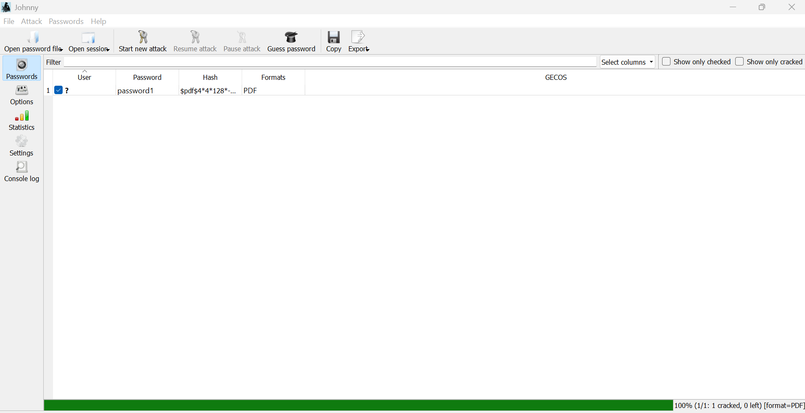
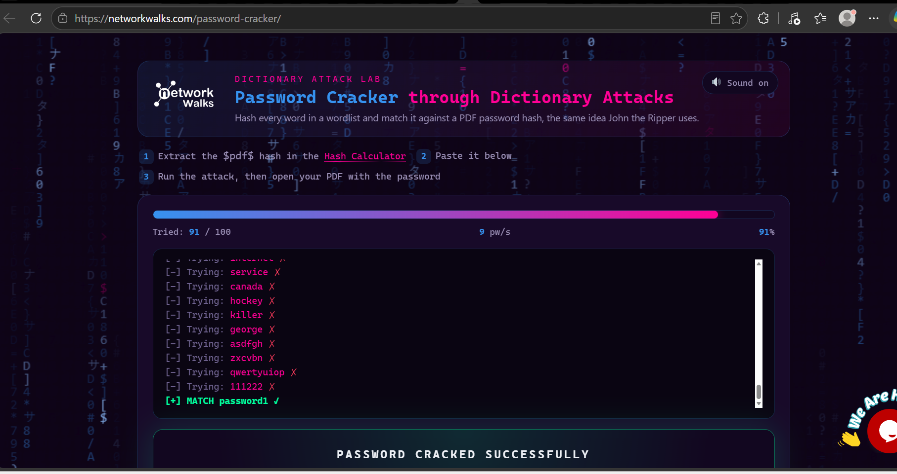
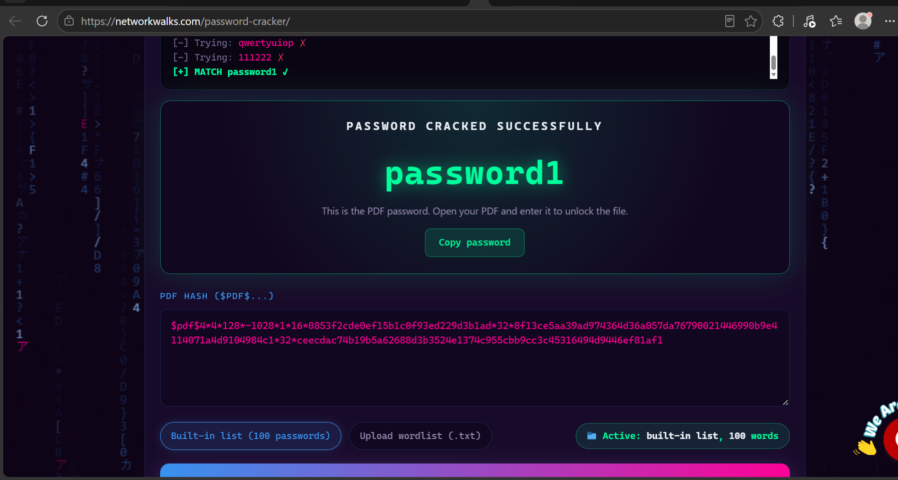

# 🔓 Password Cracking
**Hash Extraction and Password Recovery — John the Ripper & Networkwalks Tools**

  
  
  
  
  
  

---

## 📌 Overview

Week 3 of the NetworkWalks Cybersecurity & Ethical Hacking Internship 
focused on password cracking — one of the most fundamental concepts 
in offensive security.

The two practicals this week approached the same core objective from 
different angles: cracking the password of a protected PDF file. 
One used industry-standard command-line and GUI tools, the other 
used browser-based tools to demonstrate how accessible password 
cracking has become — and why strong passwords matter more than ever.

All activities were performed on authorized files in a controlled 
lab environment strictly for educational purposes.

---

## 🎯 Objectives

- Understand how password hashing works and why files store hashes 
  rather than plaintext passwords
- Extract a hash from a password-protected PDF file
- Use John the Ripper (JTR) and Johnny GUI to crack the extracted hash
- Use Networkwalks browser-based Hash Calculator and Password Cracker 
  to perform the same attack without installing software
- Understand the practical difference between weak and strong passwords

---

## 🛠️ Tools Used

| Tool | Purpose |
|---|---|
| John the Ripper (JTR) | Industry-standard command-line password cracking tool |
| Johnny GUI | Graphical interface for John the Ripper |
| Networkwalks Hash Calculator | Browser-based PDF hash extraction tool |
| Networkwalks Password Cracker | Browser-based hash cracking tool |
| OnlineHashCrack | Online PDF hash extractor (used in PM1) |

---

## 📋 Practicals Completed

### W3-PM1 — Password Cracking with John the Ripper

Used John the Ripper and its graphical interface Johnny to crack the 
password of an authorized password-protected PDF file.

**Process:**
1. Downloaded and installed John the Ripper on Windows
2. Installed Johnny GUI and linked it to the john.exe binary
3. Uploaded the locked PDF to an online hash extractor to obtain 
   the hash value in `$pdf$` format
4. Saved the hash to a text file (hash1.txt)
5. Loaded the hash file into Johnny and ran the cracking attack
6. Successfully recovered the password and opened the protected PDF

---

### W3-PM2 — Password Cracking with Networkwalks Tools

Performed the same password cracking exercise using Networkwalks' 
browser-based tools — no installation required.

**Process:**
1. Opened the Networkwalks Hash Calculator in a browser
2. Uploaded the locked PDF — the tool extracted the `$pdf$` hash 
   automatically
3. Copied the full hash value
4. Pasted it into the Networkwalks Password Cracker
5. The tool ran through password combinations and recovered the 
   plaintext password
6. Entered the cracked password to successfully open the PDF

This practical demonstrated that password cracking tools are now 
highly accessible — even without installing specialist software, 
a browser and the right tool is enough to crack weak passwords.

---

## ⚠️ Key Observations

| Finding | Security Implication |
|---|---|
| PDF hash extractable in seconds | Any password-protected file can have its hash extracted trivially |
| Weak passwords cracked almost instantly | Dictionary and brute-force attacks defeat short or common passwords |
| No installation needed for browser tools | Low technical barrier means password attacks are widely accessible |
| Hash format reveals encryption type | `$pdf$` hash prefix identifies the algorithm used |

---

## 💡 Key Takeaways

**1. Hashing is not encryption**
A hash is a one-way scramble of a password — it cannot be reversed 
directly. But that does not make it safe. Cracking tools work by 
hashing thousands of guesses per second and comparing them to the 
stored hash until they find a match. Weak passwords fall immediately.

**2. Password strength is everything**
The speed at which a password is cracked depends almost entirely on 
its complexity. A short, common password can be recovered in seconds. 
A long, random password with mixed characters can take years or 
longer — making it practically uncrackable with current hardware.

**3. File encryption is only as strong as the password**
Locking a PDF, ZIP, or Office document gives a false sense of 
security if the password protecting it is weak. The encryption 
algorithm may be strong, but the password is the real barrier — 
and if the password is weak, the file is not secure.

**4. Accessibility of attack tools has changed the threat landscape**
Week 3 made it clear that password cracking is no longer a skill 
that requires deep technical expertise. Browser-based tools lower 
the barrier significantly — which makes strong password policies 
and multi-factor authentication more important than ever.

---

## ⚖️ Liability Disclaimer

All activities in this repository were performed only on authorized 
files provided as part of an approved cybersecurity training programme. 
All materials are strictly for educational and research purposes. 
Unauthorized access to files, systems, or accounts is illegal and 
carries serious legal consequences.

---

## 🔐 Security & Ethical Use

All activities documented in this repository were performed in 
authorized, controlled environments strictly for educational and 
cybersecurity training purposes.

---

## 🔗 Tools & Resources

- **John the Ripper:** https://www.openwall.com/john/
- **Johnny GUI:** https://openwall.info/wiki/john/johnny
- **Networkwalks Hash Calculator:** https://networkwalks.com/hash-calculator/
- **Networkwalks Password Cracker:** https://networkwalks.com/password-cracker/

---

## 👤 Author

**David Awodiran**
Cybersecurity Professional

LinkedIn: https://www.linkedin.com/in/davidawodiran/

---

## 📌 Programme Info

Cybersecurity at Networkwalks | Batch B083 | Week 03
